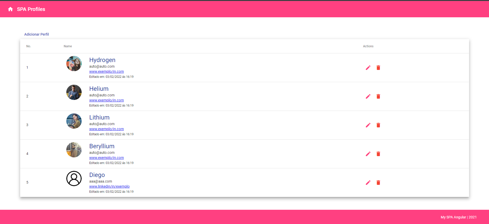

<h1 align=center>SPA PROFILES - Angular</h1>

Aplicação desenvolvida em Angular para cadastro de perfis profissionais. Desafio proposto pela [Digital Innovation One](https://www.dio.me/) no Lab: “Desenvolvendo SPA com Angular”.

<strong>Visualize o projeto <a href="#">Clicando aqui</a></strong>

## ⚙️Tecnologias:

 

## 🔥 O Desafio:

- [ ] Crie uma aplicação Angular (Não esqueça que todo código precisa estar no GitHub)
- [ ] Crie no mínimo 3 componentes que deverão estar interagindo na mesma página (Não esqueça das rotas)
- [ ] Escolha no mínimo 4 componentes do Angular Material e incorpore eles em sua aplicação.
- [ ] Crie em uma das páginas uma interação através da Interpolação e/ou utilizando Property Biding.
- [ ] Crie uma explicação sobre o que foi feito, esta explicação será inserida na plataforma junto com o link para o código no GitHub.

## 💻 A Aplicação:

A Aplicação consiste na visualização e criação de perfis profissionais. Nela podemos adicionar um novo perfil com:

- Nome
- E-mail
- Linkedin

Esses perfis podem ser editados e deletados também. Cada perfil possui uma foto também. Quando um novo perfil é cadastrado na aplicação, ele recebe uma foto padrão de uma avatar. Foi utilizado o Angular que é um Framework Javascript (baseado em Typescript) cuja plataforma nos permite a criação de aplicações web. E também a biblioteca Angular Material nos trouxe componentes baseados no Material Design, a especificação de design para interfaces interativas do Google.

- Temos 7 Componentes do Angular Material
  - Toolbar
  - Icon
  - Table
  - Button
  - Dialog
  - FormField
  - Input
- 4 Componentes interagem na mesma página:

1. Botão “Adicionar Perfil”
2. Modal Dialog “Criar Perfil” e “Editar perfil”
3. Inputs do Modal
4. Table de Perfis
5. Botões de ação: Editar e Deletar

- Interpolação e Property Binding:

1. Interpolação nas informações de perfis
2. Property Binding no nosso DATASOURCE `home.component.html` (linha 10) e `home.component.ts` (linha 30) recebendo informações do nosso **_ProfileElement._**

## 🔄Rodando o projeto

Projeto gerado com [Angular CLI](https://github.com/angular/angular-cli) versão 13.1.2.

### Servidor de desenvolvimento

Execute `ng serve` para um servidor dev. Navegue até `http://localhost:4200/`. O aplicativo será recarregado automaticamente se você alterar qualquer um dos arquivos de origem.

### Build

Execute `ng build` para compilar o projeto. Os artefatos de construção serão armazenados no diretório `dist/`.

---

🚧 Desenvolvido por [**Diego Henrique**](https://www.linkedin.com/in/diego-henrique-sg/)
